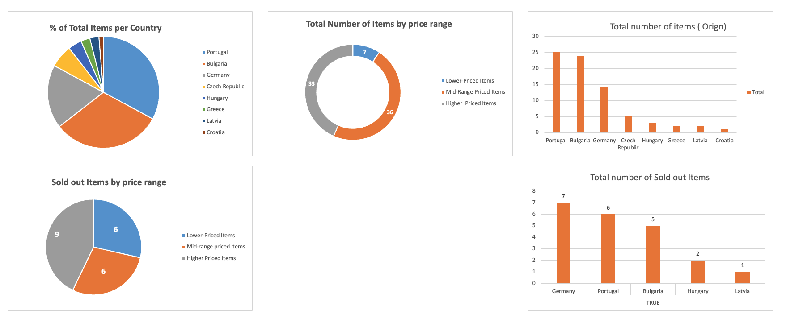

# KoRo Data Analysis Project

This project focuses on analyzing public data from the website [korodrogerie.com](https://www.korodrogerie.de/). The goal is to explore and draw meaningful conclusions from the data, such as trends, patterns, and insights related to the products or other available information.

## Project Overview
I collected data from the website and used Excel and Python for data analysis. I focused on `Sweet snacks and Protein bars` section. The conclusions were based on this analysis, and the results are presented in Excel.

### Key Conclusions
- *83% of all products in this category are produced in Portugal, Bulgaria and Germany.
- Country-Specific Stock Issues: Regarding Germany: Multiple products sourced from
Germany are sold out, such as Protein bars. This indicates that products made in
Germany, particularly in the protein bar category, may be in higher demand.
- Higher-Priced Items (€2.25 - €2.50): Many of the sold-out products are priced in the
€2.25 - €2.50 range, especially in the protein bar and vegan categories, suggesting
that consumers are willing to pay a premium for quality ingredients or specific
categories (e.g., protein and vegan products).*

## Screenshots



## Files Included
- **[Data Analysis Report (Excel)](./KoRo%20analysis.xlsx)**: A detailed report of the analysis, including tables, graphs, and summaries.
- **Python Code**: The Python scripts used for data collection, cleaning, and analysis can be found in the `scripts/` folder.
- **`requirements.txt`**: Lists all the Python packages and dependencies needed to run the code.


## How to Use the Python Code
1. Clone this repo:
    ```bash
    git clone https://github.com/your-username/koro-data-analysis.git
    ```

2. Navigate to the project folder:
    ```bash
    cd koro-data-analysis/scripts
    ```

3. Install the required Python packages:
    ```bash
    pip install -r requirements.txt
    ```

4. Run the Python scripts to analyze the data:
    ```bash
    python analyze_data.py
    ```

## License
This project is licensed under the MIT License.
